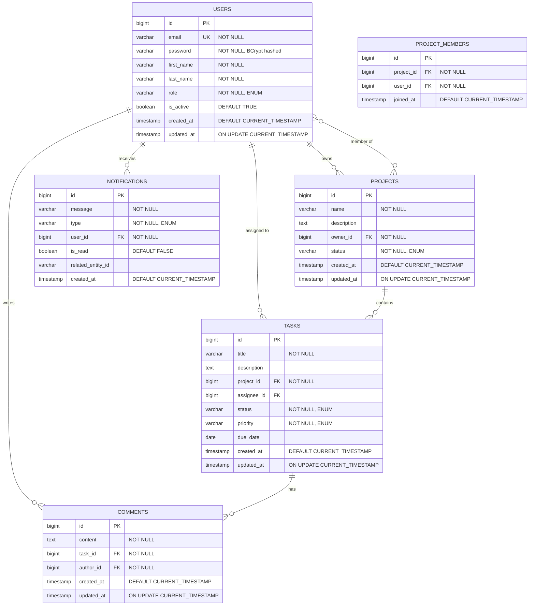

# Entity-Relationship Diagram

## Overview
TaskFlow uses PostgreSQL as the relational database. The schema is designed following normalization principles (3NF) with proper indexing for performance. The database supports multi-tenancy through project-based isolation and implements referential integrity through foreign key constraints.

## Database Schema



## Tables

### USERS
**Description**: Stores user account information with authentication credentials and role-based access control

| Column | Type | Constraints | Description |
|--------|------|-------------|-------------|
| id | BIGINT | PRIMARY KEY, AUTO_INCREMENT | Unique identifier |
| email | VARCHAR(255) | UNIQUE, NOT NULL | User email address (login credential) |
| password | VARCHAR(255) | NOT NULL | BCrypt hashed password |
| first_name | VARCHAR(100) | NOT NULL | User's first name |
| last_name | VARCHAR(100) | NOT NULL | User's last name |
| role | VARCHAR(50) | NOT NULL, CHECK | User role: ADMIN, PROJECT_MANAGER, TEAM_MEMBER |
| is_active | BOOLEAN | DEFAULT TRUE | Account status (soft delete) |
| created_at | TIMESTAMP | DEFAULT CURRENT_TIMESTAMP | Account creation time |
| updated_at | TIMESTAMP | ON UPDATE CURRENT_TIMESTAMP | Last profile update time |

**Indexes**:
- PRIMARY KEY on `id`
- UNIQUE INDEX on `email`
- INDEX on `role` (for role-based queries)
- INDEX on `is_active` (for filtering active users)

**Constraints**:
- CHECK: `role IN ('ADMIN', 'PROJECT_MANAGER', 'TEAM_MEMBER')`
- CHECK: `email ~* '^[A-Za-z0-9._%+-]+@[A-Za-z0-9.-]+\.[A-Z|a-z]{2,}$'` (email format validation)

---

### PROJECTS
**Description**: Stores project information with ownership and status tracking

| Column | Type | Constraints | Description |
|--------|------|-------------|-------------|
| id | BIGINT | PRIMARY KEY, AUTO_INCREMENT | Unique identifier |
| name | VARCHAR(255) | NOT NULL | Project name |
| description | TEXT | NULL | Detailed project description |
| owner_id | BIGINT | FOREIGN KEY, NOT NULL | Reference to USERS (project owner) |
| status | VARCHAR(50) | NOT NULL, CHECK | Project status: ACTIVE, COMPLETED, ARCHIVED |
| created_at | TIMESTAMP | DEFAULT CURRENT_TIMESTAMP | Project creation time |
| updated_at | TIMESTAMP | ON UPDATE CURRENT_TIMESTAMP | Last update time |

**Indexes**:
- PRIMARY KEY on `id`
- FOREIGN KEY on `owner_id` REFERENCES USERS(id)
- INDEX on `owner_id` (for owner's projects lookup)
- INDEX on `status` (for filtering by status)
- INDEX on `created_at` (for chronological queries)

**Constraints**:
- CHECK: `status IN ('ACTIVE', 'COMPLETED', 'ARCHIVED')`
- ON DELETE CASCADE on `owner_id` (delete projects when owner is deleted)

---

### PROJECT_MEMBERS
**Description**: Junction table for many-to-many relationship between users and projects (team membership)

| Column | Type | Constraints | Description |
|--------|------|-------------|-------------|
| id | BIGINT | PRIMARY KEY, AUTO_INCREMENT | Unique identifier |
| project_id | BIGINT | FOREIGN KEY, NOT NULL | Reference to PROJECTS |
| user_id | BIGINT | FOREIGN KEY, NOT NULL | Reference to USERS |
| joined_at | TIMESTAMP | DEFAULT CURRENT_TIMESTAMP | When user joined the project |

**Indexes**:
- PRIMARY KEY on `id`
- UNIQUE INDEX on (`project_id`, `user_id`) - prevents duplicate memberships
- FOREIGN KEY on `project_id` REFERENCES PROJECTS(id)
- FOREIGN KEY on `user_id` REFERENCES USERS(id)
- INDEX on `project_id` (for project team lookup)
- INDEX on `user_id` (for user's projects lookup)

**Constraints**:
- ON DELETE CASCADE on both foreign keys (remove membership when project or user is deleted)

---

### TASKS
**Description**: Stores task information with assignment, priority, and status tracking

| Column | Type | Constraints | Description |
|--------|------|-------------|-------------|
| id | BIGINT | PRIMARY KEY, AUTO_INCREMENT | Unique identifier |
| title | VARCHAR(255) | NOT NULL | Task title |
| description | TEXT | NULL | Detailed task description |
| project_id | BIGINT | FOREIGN KEY, NOT NULL | Reference to PROJECTS |
| assignee_id | BIGINT | FOREIGN KEY, NULL | Reference to USERS (assigned team member) |
| status | VARCHAR(50) | NOT NULL, CHECK | Task status: TODO, IN_PROGRESS, REVIEW, DONE |
| priority | VARCHAR(50) | NOT NULL, CHECK | Priority: LOW, MEDIUM, HIGH, CRITICAL |
| due_date | DATE | NULL | Task deadline |
| created_at | TIMESTAMP | DEFAULT CURRENT_TIMESTAMP | Task creation time |
| updated_at | TIMESTAMP | ON UPDATE CURRENT_TIMESTAMP | Last update time |

**Indexes**:
- PRIMARY KEY on `id`
- FOREIGN KEY on `project_id` REFERENCES PROJECTS(id)
- FOREIGN KEY on `assignee_id` REFERENCES USERS(id)
- INDEX on `project_id` (for project tasks lookup)
- INDEX on `assignee_id` (for user's assigned tasks)
- INDEX on `status` (for filtering by status)
- INDEX on `priority` (for filtering by priority)
- INDEX on `due_date` (for deadline queries and overdue detection)
- COMPOSITE INDEX on (`project_id`, `status`) (for project task filtering)

**Constraints**:
- CHECK: `status IN ('TODO', 'IN_PROGRESS', 'REVIEW', 'DONE')`
- CHECK: `priority IN ('LOW', 'MEDIUM', 'HIGH', 'CRITICAL')`
- CHECK: `due_date >= CURRENT_DATE` (optional, can be removed to allow past dates for tracking)
- ON DELETE CASCADE on `project_id` (delete tasks when project is deleted)
- ON DELETE SET NULL on `assignee_id` (unassign task when user is deleted)

---

### COMMENTS
**Description**: Stores comments on tasks for collaboration and discussion

| Column | Type | Constraints | Description |
|--------|------|-------------|-------------|
| id | BIGINT | PRIMARY KEY, AUTO_INCREMENT | Unique identifier |
| content | TEXT | NOT NULL | Comment text content |
| task_id | BIGINT | FOREIGN KEY, NOT NULL | Reference to TASKS |
| author_id | BIGINT | FOREIGN KEY, NOT NULL | Reference to USERS (comment author) |
| created_at | TIMESTAMP | DEFAULT CURRENT_TIMESTAMP | Comment creation time |
| updated_at | TIMESTAMP | ON UPDATE CURRENT_TIMESTAMP | Last edit time |

**Indexes**:
- PRIMARY KEY on `id`
- FOREIGN KEY on `task_id` REFERENCES TASKS(id)
- FOREIGN KEY on `author_id` REFERENCES USERS(id)
- INDEX on `task_id` (for task comments lookup)
- INDEX on `author_id` (for user's comments)
- INDEX on `created_at` (for chronological ordering)

**Constraints**:
- CHECK: `LENGTH(content) > 0` (prevent empty comments)
- ON DELETE CASCADE on `task_id` (delete comments when task is deleted)
- ON DELETE CASCADE on `author_id` (delete comments when user is deleted)

---

### NOTIFICATIONS
**Description**: Stores in-app notifications for users about task assignments, updates, and comments

| Column | Type | Constraints | Description |
|--------|------|-------------|-------------|
| id | BIGINT | PRIMARY KEY, AUTO_INCREMENT | Unique identifier |
| message | VARCHAR(500) | NOT NULL | Notification message text |
| type | VARCHAR(50) | NOT NULL, CHECK | Notification type enum |
| user_id | BIGINT | FOREIGN KEY, NOT NULL | Reference to USERS (recipient) |
| is_read | BOOLEAN | DEFAULT FALSE | Read status |
| related_entity_id | VARCHAR(100) | NULL | ID of related entity (task, project, etc.) |
| created_at | TIMESTAMP | DEFAULT CURRENT_TIMESTAMP | Notification creation time |

**Indexes**:
- PRIMARY KEY on `id`
- FOREIGN KEY on `user_id` REFERENCES USERS(id)
- INDEX on `user_id` (for user's notifications)
- COMPOSITE INDEX on (`user_id`, `is_read`) (for unread notifications query)
- INDEX on `created_at` (for chronological ordering)

**Constraints**:
- CHECK: `type IN ('TASK_ASSIGNED', 'TASK_UPDATED', 'COMMENT_ADDED', 'PROJECT_INVITATION')`
- ON DELETE CASCADE on `user_id` (delete notifications when user is deleted)

---

## Relationships

### One-to-Many Relationships

1. **USERS → PROJECTS (Owner)**
   - One user can own many projects
   - Cardinality: 1:N
   - Foreign Key: `projects.owner_id` → `users.id`
   - On Delete: CASCADE (delete user's projects when user is deleted)
   - Business Rule: Only users with PROJECT_MANAGER or ADMIN role can own projects

2. **USERS → TASKS (Assignee)**
   - One user can be assigned to many tasks
   - Cardinality: 1:N
   - Foreign Key: `tasks.assignee_id` → `users.id`
   - On Delete: SET NULL (unassign task when user is deleted, task remains)
   - Business Rule: Only project team members can be assigned tasks

3. **PROJECTS → TASKS**
   - One project can contain many tasks
   - Cardinality: 1:N
   - Foreign Key: `tasks.project_id` → `projects.id`
   - On Delete: CASCADE (delete all tasks when project is deleted)

4. **TASKS → COMMENTS**
   - One task can have many comments
   - Cardinality: 1:N
   - Foreign Key: `comments.task_id` → `tasks.id`
   - On Delete: CASCADE (delete all comments when task is deleted)

5. **USERS → COMMENTS (Author)**
   - One user can write many comments
   - Cardinality: 1:N
   - Foreign Key: `comments.author_id` → `users.id`
   - On Delete: CASCADE (delete user's comments when user is deleted)

6. **USERS → NOTIFICATIONS**
   - One user can receive many notifications
   - Cardinality: 1:N
   - Foreign Key: `notifications.user_id` → `users.id`
   - On Delete: CASCADE (delete user's notifications when user is deleted)

### Many-to-Many Relationships

1. **USERS ↔ PROJECTS (Team Membership)**
   - Many users can be members of many projects
   - Cardinality: M:N
   - Junction Table: `PROJECT_MEMBERS`
   - Foreign Keys: 
     - `project_members.user_id` → `users.id`
     - `project_members.project_id` → `projects.id`
   - On Delete: CASCADE on both sides
   - Business Rule: Project owner is automatically a team member

## Normalization

### Current Normal Form: 3NF (Third Normal Form)

**1NF (First Normal Form)**:
- All tables have primary keys
- All columns contain atomic values (no arrays or nested structures)
- No repeating groups

**2NF (Second Normal Form)**:
- Meets 1NF requirements
- No partial dependencies (all non-key attributes depend on the entire primary key)
- Junction table PROJECT_MEMBERS properly separates the many-to-many relationship

**3NF (Third Normal Form)**:
- Meets 2NF requirements
- No transitive dependencies (non-key attributes don't depend on other non-key attributes)
- Each table represents a single entity with its direct attributes

**Denormalization Considerations**:
- Could add `task_count` to PROJECTS for performance (currently calculated via COUNT query)
- Could add `unread_notification_count` to USERS for dashboard performance
- Trade-off: Improved read performance vs. data consistency complexity

## Database Constraints

### Referential Integrity
- All foreign keys enforce referential integrity
- CASCADE delete rules maintain consistency for dependent data
- SET NULL used for optional relationships (task assignee)

### Data Integrity
- NOT NULL constraints on required fields
- UNIQUE constraints prevent duplicates (email, project membership)
- CHECK constraints enforce valid enum values
- DEFAULT values ensure consistent initialization

### Business Rules Enforced at Database Level
1. Email uniqueness across all users
2. One user cannot join the same project twice
3. Task status and priority must be valid enum values
4. Project status must be valid enum value
5. User role must be valid enum value

### Business Rules Enforced at Application Level
1. Only project managers can create projects
2. Only project team members can be assigned tasks
3. Only task assignees can update task status
4. Only comment authors can edit their comments
5. Due dates should not be in the past (warning, not hard constraint)

## Performance Considerations

### Indexing Strategy
1. **Primary Keys**: Clustered indexes for fast row lookup
2. **Foreign Keys**: Indexed for efficient JOIN operations
3. **Composite Indexes**: 
   - (`project_id`, `status`) on TASKS for filtered project task queries
   - (`user_id`, `is_read`) on NOTIFICATIONS for unread notifications
4. **Timestamp Indexes**: For chronological queries and sorting

### Query Optimization
- Use of covering indexes where possible
- Avoid N+1 query problems with JPA fetch strategies
- Pagination for large result sets
- Caching frequently accessed data (user profiles, project details)

### Scalability Considerations
- Partitioning NOTIFICATIONS table by `created_at` (time-based partitioning)
- Archiving old completed projects and their tasks
- Read replicas for reporting and analytics queries
- Connection pooling for efficient database connections

## Sample Queries

### Get all tasks for a project with assignee details
```sql
SELECT t.*, u.first_name, u.last_name, u.email
FROM tasks t
LEFT JOIN users u ON t.assignee_id = u.id
WHERE t.project_id = ?
ORDER BY t.priority DESC, t.due_date ASC;
```

### Get user's unread notifications
```sql
SELECT *
FROM notifications
WHERE user_id = ? AND is_read = FALSE
ORDER BY created_at DESC
LIMIT 20;
```

### Get project completion statistics
```sql
SELECT 
    p.id,
    p.name,
    COUNT(t.id) as total_tasks,
    SUM(CASE WHEN t.status = 'DONE' THEN 1 ELSE 0 END) as completed_tasks,
    ROUND(100.0 * SUM(CASE WHEN t.status = 'DONE' THEN 1 ELSE 0 END) / COUNT(t.id), 2) as completion_percentage
FROM projects p
LEFT JOIN tasks t ON p.id = t.project_id
WHERE p.id = ?
GROUP BY p.id, p.name;
```

### Get overdue tasks
```sql
SELECT t.*, p.name as project_name, u.email as assignee_email
FROM tasks t
JOIN projects p ON t.project_id = p.id
LEFT JOIN users u ON t.assignee_id = u.id
WHERE t.due_date < CURRENT_DATE 
  AND t.status != 'DONE'
ORDER BY t.due_date ASC;
```

## Migration Strategy

### Initial Schema Creation
1. Create USERS table first (no dependencies)
2. Create PROJECTS table (depends on USERS)
3. Create PROJECT_MEMBERS table (depends on USERS and PROJECTS)
4. Create TASKS table (depends on PROJECTS and USERS)
5. Create COMMENTS table (depends on TASKS and USERS)
6. Create NOTIFICATIONS table (depends on USERS)

### Seed Data
1. Create admin user
2. Create sample projects
3. Add team members to projects
4. Create sample tasks

### Backup and Recovery
- Daily automated backups
- Point-in-time recovery enabled
- Transaction logs retained for 7 days
