# Class Diagram

## Overview
TaskFlow follows a layered architecture with clear separation of concerns. The system is built using Spring Boot with JPA/Hibernate for ORM. The architecture emphasizes OOP principles, design patterns, and clean code practices.

## Architecture Layers
- **Controllers**: Handle HTTP requests/responses, input validation, JWT authentication
- **Services**: Business logic, validation, orchestration, transaction management
- **Repositories**: Data access layer using Spring Data JPA interfaces
- **Entities**: Domain models mapped to database tables
- **DTOs**: Data transfer objects for API contracts
- **Security**: JWT authentication, role-based authorization
- **Exceptions**: Custom exception hierarchy for error handling

## Class Diagram

```mermaid
classDiagram
    %% ============ CONTROLLERS ============
    class TaskController {
        -TaskService taskService
        +createTask(TaskDTO, Principal) ResponseEntity~TaskResponseDTO~
        +updateTask(Long, TaskDTO, Principal) ResponseEntity~TaskResponseDTO~
        +deleteTask(Long, Principal) ResponseEntity~Void~
        +getTaskById(Long) ResponseEntity~TaskResponseDTO~
        +getTasksByProject(Long) ResponseEntity~List~TaskResponseDTO~~
        +assignTask(Long, Long, Principal) ResponseEntity~TaskResponseDTO~
    }
    
    class ProjectController {
        -ProjectService projectService
        +createProject(ProjectDTO, Principal) ResponseEntity~ProjectResponseDTO~
        +updateProject(Long, ProjectDTO) ResponseEntity~ProjectResponseDTO~
        +deleteProject(Long) ResponseEntity~Void~
        +getProjectById(Long) ResponseEntity~ProjectResponseDTO~
        +addTeamMember(Long, Long) ResponseEntity~Void~
        +removeTeamMember(Long, Long) ResponseEntity~Void~
    }
    
    class UserController {
        -UserService userService
        -AuthenticationService authService
        +register(RegisterDTO) ResponseEntity~AuthResponseDTO~
        +login(LoginDTO) ResponseEntity~AuthResponseDTO~
        +getProfile(Principal) ResponseEntity~UserResponseDTO~
        +updateProfile(UserDTO, Principal) ResponseEntity~UserResponseDTO~
    }
    
    class CommentController {
        -CommentService commentService
        +addComment(Long, CommentDTO, Principal) ResponseEntity~CommentResponseDTO~
        +updateComment(Long, CommentDTO, Principal) ResponseEntity~CommentResponseDTO~
        +deleteComment(Long, Principal) ResponseEntity~Void~
        +getCommentsByTask(Long) ResponseEntity~List~CommentResponseDTO~~
    }
    
    %% ============ SERVICES ============
    class TaskService {
        -TaskRepository taskRepository
        -ProjectRepository projectRepository
        -UserRepository userRepository
        -NotificationService notificationService
        +createTask(TaskDTO, Long) Task
        +updateTask(Long, TaskDTO, Long) Task
        +deleteTask(Long, Long) void
        +getTaskById(Long) Task
        +assignTask(Long, Long, Long) Task
        +updateTaskStatus(Long, TaskStatus, Long) Task
        -validateProjectAccess(Long, Long) void
        -validateUserInProject(Long, Long) void
        -buildTaskEntity(TaskDTO) Task
    }
    
    class ProjectService {
        -ProjectRepository projectRepository
        -UserRepository userRepository
        +createProject(ProjectDTO, Long) Project
        +updateProject(Long, ProjectDTO) Project
        +deleteProject(Long) void
        +getProjectById(Long) Project
        +addTeamMember(Long, Long) void
        +removeTeamMember(Long, Long) void
        -validateProjectOwnership(Long, Long) void
    }
    
    class UserService {
        -UserRepository userRepository
        -PasswordEncoder passwordEncoder
        +registerUser(RegisterDTO) User
        +getUserById(Long) User
        +getUserByEmail(String) User
        +updateUser(Long, UserDTO) User
        -validateUserData(RegisterDTO) void
    }
    
    class AuthenticationService {
        -UserRepository userRepository
        -PasswordEncoder passwordEncoder
        -JwtTokenProvider jwtTokenProvider
        +authenticate(LoginDTO) AuthResponseDTO
        +validateToken(String) boolean
        -generateToken(User) String
    }
    
    class CommentService {
        -CommentRepository commentRepository
        -TaskRepository taskRepository
        -UserRepository userRepository
        +addComment(Long, CommentDTO, Long) Comment
        +updateComment(Long, CommentDTO, Long) Comment
        +deleteComment(Long, Long) void
        +getCommentsByTask(Long) List~Comment~
        -validateTaskAccess(Long, Long) void
    }
    
    class NotificationService {
        -NotificationRepository notificationRepository
        -EmailService emailService
        -NotificationStrategy strategy
        +notifyTaskAssignment(Task, User) void
        +notifyTaskStatusChange(Task, TaskStatus) void
        +notifyComment(Comment, Task) void
        -createNotification(User, String, NotificationType) Notification
        +setNotificationStrategy(NotificationStrategy) void
    }
    
    %% ============ REPOSITORIES ============
    class TaskRepository {
        <<interface>>
        +save(Task) Task
        +findById(Long) Optional~Task~
        +findByProjectId(Long) List~Task~
        +findByAssigneeId(Long) List~Task~
        +findByStatus(TaskStatus) List~Task~
        +deleteById(Long) void
    }
    
    class ProjectRepository {
        <<interface>>
        +save(Project) Project
        +findById(Long) Optional~Project~
        +findByOwnerId(Long) List~Project~
        +deleteById(Long) void
    }
    
    class UserRepository {
        <<interface>>
        +save(User) User
        +findById(Long) Optional~User~
        +findByEmail(String) Optional~User~
        +existsByEmail(String) boolean
        +deleteById(Long) void
    }
    
    class CommentRepository {
        <<interface>>
        +save(Comment) Comment
        +findById(Long) Optional~Comment~
        +findByTaskId(Long) List~Comment~
        +deleteById(Long) void
    }
    
    class NotificationRepository {
        <<interface>>
        +save(Notification) Notification
        +findByUserId(Long) List~Notification~
        +findByUserIdAndIsRead(Long, boolean) List~Notification~
    }
    
    %% ============ ENTITIES ============
    class BaseEntity {
        <<abstract>>
        #Long id
        #LocalDateTime createdAt
        #LocalDateTime updatedAt
        +getId() Long
        +getCreatedAt() LocalDateTime
    }
    
    class User {
        -String email
        -String password
        -String firstName
        -String lastName
        -Role role
        -boolean isActive
        -Set~Project~ projects
        -Set~Task~ assignedTasks
        +getFullName() String
        +isActive() boolean
        +hasRole(Role) boolean
    }
    
    class Project {
        -String name
        -String description
        -User owner
        -Set~User~ teamMembers
        -Set~Task~ tasks
        -ProjectStatus status
        +addTeamMember(User) void
        +removeTeamMember(User) void
        +isTeamMember(User) boolean
        +getCompletionPercentage() double
    }
    
    class Task {
        -String title
        -String description
        -Project project
        -User assignee
        -TaskStatus status
        -Priority priority
        -LocalDate dueDate
        -Set~Comment~ comments
        +isOverdue() boolean
        +canBeEditedBy(User) boolean
        +updateStatus(TaskStatus) void
        +assignTo(User) void
    }
    
    class Comment {
        -String content
        -Task task
        -User author
        +isAuthor(User) boolean
        +canBeEditedBy(User) boolean
    }
    
    class Notification {
        -String message
        -NotificationType type
        -User user
        -boolean isRead
        -String relatedEntityId
        +markAsRead() void
        +isUnread() boolean
    }
    
    %% ============ ENUMS ============
    class Role {
        <<enumeration>>
        ADMIN
        PROJECT_MANAGER
        TEAM_MEMBER
    }
    
    class TaskStatus {
        <<enumeration>>
        TODO
        IN_PROGRESS
        REVIEW
        DONE
    }
    
    class Priority {
        <<enumeration>>
        LOW
        MEDIUM
        HIGH
        CRITICAL
    }
    
    class NotificationType {
        <<enumeration>>
        TASK_ASSIGNED
        TASK_UPDATED
        COMMENT_ADDED
        PROJECT_INVITATION
    }
    
    class ProjectStatus {
        <<enumeration>>
        ACTIVE
        COMPLETED
        ARCHIVED
    }
    
    %% ============ DTOs ============
    class TaskDTO {
        -String title
        -String description
        -Long projectId
        -Long assigneeId
        -Priority priority
        -LocalDate dueDate
        +validate() boolean
    }
    
    class TaskResponseDTO {
        -Long id
        -String title
        -String description
        -UserResponseDTO assignee
        -TaskStatus status
        -Priority priority
        -LocalDate dueDate
        -LocalDateTime createdAt
    }
    
    class ProjectDTO {
        -String name
        -String description
        +validate() boolean
    }
    
    class ProjectResponseDTO {
        -Long id
        -String name
        -String description
        -UserResponseDTO owner
        -List~UserResponseDTO~ teamMembers
        -int taskCount
        -double completionPercentage
    }
    
    class RegisterDTO {
        -String email
        -String password
        -String firstName
        -String lastName
        +validate() boolean
    }
    
    class LoginDTO {
        -String email
        -String password
    }
    
    class UserResponseDTO {
        -Long id
        -String email
        -String firstName
        -String lastName
        -Role role
    }
    
    class AuthResponseDTO {
        -String token
        -UserResponseDTO user
    }
    
    class CommentDTO {
        -String content
        +validate() boolean
    }
    
    class CommentResponseDTO {
        -Long id
        -String content
        -UserResponseDTO author
        -LocalDateTime createdAt
    }
    
    %% ============ SECURITY ============
    class JwtTokenProvider {
        -String secretKey
        -long validityInMilliseconds
        +generateToken(User) String
        +validateToken(String) boolean
        +getUserIdFromToken(String) Long
        +getExpirationDate(String) Date
    }
    
    class SecurityConfig {
        -JwtTokenProvider jwtTokenProvider
        +securityFilterChain(HttpSecurity) SecurityFilterChain
        +passwordEncoder() PasswordEncoder
        +authenticationManager() AuthenticationManager
    }
    
    %% ============ STRATEGY PATTERN ============
    class NotificationStrategy {
        <<interface>>
        +send(User, String) void
    }
    
    class EmailNotificationStrategy {
        -EmailService emailService
        +send(User, String) void
    }
    
    class InAppNotificationStrategy {
        -NotificationRepository notificationRepository
        +send(User, String) void
    }
    
    %% ============ EXCEPTIONS ============
    class BaseException {
        <<abstract>>
        #String message
        #HttpStatus status
        +getMessage() String
        +getStatus() HttpStatus
    }
    
    class ResourceNotFoundException {
        +ResourceNotFoundException(String)
    }
    
    class UnauthorizedException {
        +UnauthorizedException(String)
    }
    
    class ValidationException {
        +ValidationException(String)
    }
    
    %% ============ RELATIONSHIPS ============
    
    %% Controller -> Service
    TaskController --> TaskService
    ProjectController --> ProjectService
    UserController --> UserService
    UserController --> AuthenticationService
    CommentController --> CommentService
    
    %% Service -> Repository
    TaskService --> TaskRepository
    TaskService --> ProjectRepository
    TaskService --> UserRepository
    TaskService --> NotificationService
    ProjectService --> ProjectRepository
    ProjectService --> UserRepository
    UserService --> UserRepository
    AuthenticationService --> UserRepository
    AuthenticationService --> JwtTokenProvider
    CommentService --> CommentRepository
    CommentService --> TaskRepository
    CommentService --> UserRepository
    NotificationService --> NotificationRepository
    NotificationService --> NotificationStrategy
    
    %% Repository -> Entity
    TaskRepository --> Task
    ProjectRepository --> Project
    UserRepository --> User
    CommentRepository --> Comment
    NotificationRepository --> Notification
    
    %% Entity Inheritance
    User --|> BaseEntity
    Project --|> BaseEntity
    Task --|> BaseEntity
    Comment --|> BaseEntity
    Notification --|> BaseEntity
    
    %% Entity Relationships
    Task --> Project : belongs to
    Task --> User : assigned to
    Task --> Priority : has
    Task --> TaskStatus : has
    Task --> Comment : has many
    Project --> User : owned by
    Project --> User : has many team members
    Project --> Task : has many
    Project --> ProjectStatus : has
    Comment --> Task : belongs to
    Comment --> User : written by
    Notification --> User : sent to
    Notification --> NotificationType : has
    User --> Role : has
    
    %% DTO Relationships
    TaskController --> TaskDTO : receives
    TaskController --> TaskResponseDTO : returns
    ProjectController --> ProjectDTO : receives
    ProjectController --> ProjectResponseDTO : returns
    UserController --> RegisterDTO : receives
    UserController --> LoginDTO : receives
    UserController --> AuthResponseDTO : returns
    UserController --> UserResponseDTO : returns
    CommentController --> CommentDTO : receives
    CommentController --> CommentResponseDTO : returns
    
    %% Strategy Pattern
    EmailNotificationStrategy ..|> NotificationStrategy
    InAppNotificationStrategy ..|> NotificationStrategy
    
    %% Exception Hierarchy
    ResourceNotFoundException --|> BaseException
    UnauthorizedException --|> BaseException
    ValidationException --|> BaseException
```

## Class Descriptions

### Controllers

#### TaskController
- **Responsibility**: Handle HTTP requests for task operations
- **Dependencies**: TaskService
- **Design Pattern**: Dependency Injection, MVC Pattern
- **Endpoints**: POST /api/tasks, PUT /api/tasks/{id}, DELETE /api/tasks/{id}, GET /api/tasks/{id}

#### ProjectController
- **Responsibility**: Handle HTTP requests for project management
- **Dependencies**: ProjectService
- **Security**: JWT authentication, role-based authorization

#### UserController
- **Responsibility**: Handle user registration, authentication, and profile management
- **Dependencies**: UserService, AuthenticationService

#### CommentController
- **Responsibility**: Handle task comment operations
- **Dependencies**: CommentService

### Services

#### TaskService
- **Responsibility**: Business logic for task management
- **Dependencies**: TaskRepository, ProjectRepository, UserRepository, NotificationService
- **OOP Principles**: 
  - Encapsulation: Hides business logic complexity
  - Single Responsibility: Only handles task-related operations
- **Design Patterns**: Factory Pattern (buildTaskEntity), Service Layer Pattern

#### ProjectService
- **Responsibility**: Business logic for project management
- **Key Methods**: Validates ownership, manages team members, calculates metrics

#### UserService
- **Responsibility**: User management and validation
- **Security**: Password hashing with BCrypt

#### AuthenticationService
- **Responsibility**: User authentication and JWT token management
- **Design Pattern**: Strategy Pattern for authentication methods

#### NotificationService
- **Responsibility**: Send notifications via multiple channels
- **Design Pattern**: Strategy Pattern, Observer Pattern
- **Flexibility**: Can switch between email and in-app notifications

### Repositories

All repositories extend Spring Data JPA's `JpaRepository` interface, providing:
- **Abstraction**: Interface-based data access
- **Design Pattern**: Repository Pattern
- **Benefits**: Easy testing with mocks, database independence

### Entities

#### BaseEntity (Abstract)
- **Responsibility**: Provide common fields for all entities
- **OOP Principle**: Inheritance - DRY principle
- **Fields**: id, createdAt, updatedAt

#### User
- **Responsibility**: Domain model representing a user
- **Relationships**: Many-to-Many with Project, One-to-Many with Task
- **OOP Principles**: Encapsulation, business methods (getFullName, hasRole)

#### Project
- **Responsibility**: Domain model representing a project
- **Business Logic**: Team member management, completion calculation
- **Relationships**: Many-to-One with User (owner), Many-to-Many with User (team), One-to-Many with Task

#### Task
- **Responsibility**: Domain model representing a task
- **Business Logic**: Status transitions, overdue checking, permission validation
- **Relationships**: Many-to-One with Project and User, One-to-Many with Comment

#### Comment
- **Responsibility**: Domain model for task comments
- **Business Logic**: Author validation, edit permissions

#### Notification
- **Responsibility**: Domain model for user notifications
- **Business Logic**: Read/unread status management

### DTOs

#### Purpose
- Decouple API contracts from domain models
- Control data exposure (hide sensitive fields)
- Enable validation without polluting entities
- **Design Pattern**: Data Transfer Object Pattern

### Security

#### JwtTokenProvider
- **Responsibility**: JWT token generation and validation
- **Security**: Uses HMAC-SHA256 algorithm

#### SecurityConfig
- **Responsibility**: Spring Security configuration
- **Features**: JWT filter, password encoding, endpoint authorization

### Design Patterns

1. **Repository Pattern**
   - All Repository interfaces
   - Abstracts data access logic

2. **Service Layer Pattern**
   - All Service classes
   - Separates business logic from controllers

3. **DTO Pattern**
   - All DTO classes
   - Decouples API from domain models

4. **Factory Pattern**
   - buildTaskEntity() in TaskService
   - Encapsulates object creation

5. **Strategy Pattern**
   - NotificationStrategy interface with Email and InApp implementations
   - Allows runtime selection of notification method

6. **Observer Pattern**
   - NotificationService observes task events
   - Loose coupling between task operations and notifications

7. **Dependency Injection**
   - Throughout all layers
   - Loose coupling, easier testing

8. **MVC Pattern**
   - Controllers (View), Services (Controller), Repositories (Model)
   - Separation of concerns

### Exception Hierarchy

- **BaseException**: Abstract base for all custom exceptions
- **ResourceNotFoundException**: 404 errors (entity not found)
- **UnauthorizedException**: 403 errors (permission denied)
- **ValidationException**: 400 errors (invalid input)

## OOP Principles Applied

### Encapsulation
- Private fields with controlled access through getters/setters
- Business logic hidden within service layer
- DTOs protect entity internals from external exposure

### Abstraction
- Repository interfaces abstract data access
- Service interfaces define contracts
- NotificationStrategy abstracts notification delivery

### Inheritance
- BaseEntity provides common fields to all entities
- Exception hierarchy with BaseException
- Role-based user hierarchy (implicit through Role enum)

### Polymorphism
- NotificationStrategy implementations (Email, InApp)
- Repository methods work with interface types
- Service layer methods accept interface parameters

## Transaction Management

- **@Transactional** annotations on service methods
- ACID properties maintained
- Rollback on exceptions
- Isolation levels configured per operation
