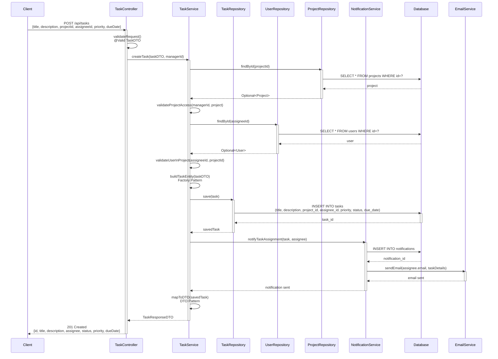
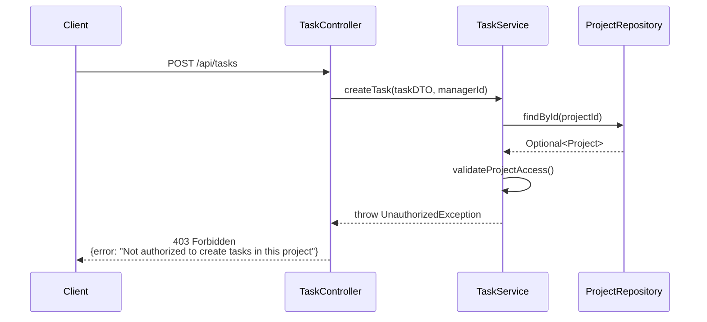
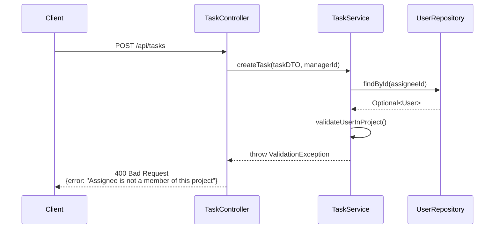
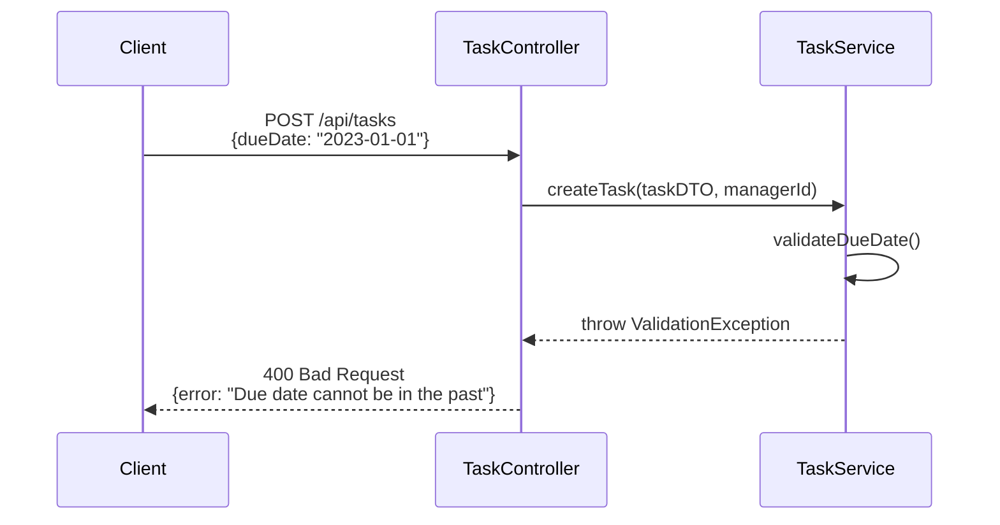

# Sequence Diagram

## Main Flow: Task Creation and Assignment

### Scenario
This diagram shows the complete end-to-end flow when a Project Manager creates a new task and assigns it to a team member. It demonstrates the layered architecture, OOP principles, and design patterns used in the backend.

### Participants
- **Client/Frontend**: React application (Project Manager's browser)
- **TaskController**: REST API endpoint handler
- **TaskService**: Business logic layer
- **TaskRepository**: Data access interface (JPA)
- **UserRepository**: User data access
- **ProjectRepository**: Project data access
- **NotificationService**: Handles notifications
- **Database**: PostgreSQL database
- **EmailService**: External email notification service

## Sequence Flow

## Step-by-Step Description

1. **Client Request (Frontend)**
   - Project Manager fills task creation form
   - React app sends POST request to `/api/tasks` with task details
   - JWT token included in Authorization header

2. **Controller Layer (TaskController)**
   - Receives HTTP request
   - Spring Security validates JWT token and extracts user identity
   - `@Valid` annotation triggers DTO validation (Bean Validation)
   - Delegates to TaskService with validated DTO

3. **Service Layer - Validation Phase (TaskService)**
   - Retrieves project from database via ProjectRepository
   - Validates manager has permission to create tasks in this project
   - Retrieves assignee user from database via UserRepository
   - Validates assignee is a member of the project
   - Business rule validation (due date not in past, valid priority, etc.)

4. **Service Layer - Task Creation (TaskService)**
   - Uses Factory Pattern to build Task entity from DTO
   - Sets default values (status = TODO, createdAt = now)
   - Applies business logic (e.g., auto-priority based on due date)

5. **Repository Layer (TaskRepository)**
   - JPA repository constructs SQL INSERT statement
   - Hibernate ORM maps entity to database columns
   - Executes INSERT operation with transaction management

6. **Database (PostgreSQL)**
   - Stores task record in tasks table
   - Generates auto-increment ID
   - Updates foreign key relationships
   - Returns generated task ID

7. **Notification Phase (NotificationService)**
   - Creates in-app notification record
   - Uses Strategy Pattern to determine notification method
   - Sends email notification via EmailService
   - Observer Pattern: Task creation event triggers notification

8. **Response Flow**
   - TaskService maps entity to TaskResponseDTO (DTO Pattern)
   - Hides sensitive data, formats dates
   - TaskController wraps in ResponseEntity with 201 status
   - Client receives task details with generated ID

## Alternative Flows

### Error Case 1: Unauthorized Access

### Error Case 2: Assignee Not in Project

### Error Case 3: Invalid Due Date

## Design Patterns Used

1. **Repository Pattern**
   - Where: TaskRepository, UserRepository, ProjectRepository
   - Why: Abstracts data access logic, enables easy testing with mocks, follows Dependency Inversion Principle

2. **Service Layer Pattern**
   - Where: TaskService, NotificationService
   - Why: Separates business logic from controllers, promotes Single Responsibility Principle

3. **DTO Pattern (Data Transfer Object)**
   - Where: TaskDTO (request), TaskResponseDTO (response)
   - Why: Decouples API contracts from domain models, controls data exposure, enables validation

4. **Factory Pattern**
   - Where: buildTaskEntity() method in TaskService
   - Why: Encapsulates complex object creation logic, ensures consistent entity initialization

5. **Strategy Pattern**
   - Where: NotificationService (email vs in-app notifications)
   - Why: Allows runtime selection of notification delivery method, follows Open/Closed Principle

6. **Observer Pattern**
   - Where: Task creation event triggers notification
   - Why: Loose coupling between task creation and notification logic

7. **Dependency Injection**
   - Where: Throughout all layers (Spring's @Autowired)
   - Why: Loose coupling, easier testing, follows Dependency Inversion Principle

## OOP Principles Demonstrated

- **Encapsulation**: Private fields in entities, controlled access via getters/setters
- **Abstraction**: Repository interfaces abstract database operations
- **Inheritance**: Task entity extends BaseEntity (id, timestamps)
- **Polymorphism**: NotificationService can use different notification strategies
