# Use Case Diagram

## Actors
- **Guest**: Unauthenticated user who can only register or login
- **Team Member**: Authenticated user who can view and work on assigned tasks
- **Project Manager**: Can create projects, assign tasks, and manage team members
- **Admin**: Has full system access including user management and system configuration

## Use Cases

### Guest Use Cases
1. **Register Account**
   - Description: Create a new user account with email and password
   - Preconditions: Valid email address not already registered
   - Postconditions: User account created, verification email sent

2. **Login**
   - Description: Authenticate with email and password
   - Preconditions: Valid registered account
   - Postconditions: JWT token generated, user session established

### Team Member Use Cases
1. **View Assigned Tasks**
   - Description: See all tasks assigned to the user
   - Preconditions: User is authenticated and part of a project
   - Postconditions: List of tasks displayed with details

2. **Update Task Status**
   - Description: Change task status (TODO → IN_PROGRESS → REVIEW → DONE)
   - Preconditions: User is assigned to the task
   - Postconditions: Task status updated, notifications sent

3. **Add Comments**
   - Description: Comment on tasks for collaboration
   - Preconditions: User has access to the task
   - Postconditions: Comment saved, team members notified

4. **View Dashboard**
   - Description: See personal task statistics and deadlines
   - Preconditions: User is authenticated
   - Postconditions: Dashboard with metrics displayed

5. **Update Profile**
   - Description: Modify user profile information
   - Preconditions: User is authenticated
   - Postconditions: Profile updated in database

### Project Manager Use Cases
1. **Create Project**
   - Description: Create a new project with details
   - Preconditions: User has Project Manager role
   - Postconditions: Project created, manager assigned as owner

2. **Assign Team Members**
   - Description: Add users to project team
   - Preconditions: Project exists, users are registered
   - Postconditions: Team members added with appropriate roles

3. **Create Task**
   - Description: Create new task with title, description, priority, and due date
   - Preconditions: Project exists
   - Postconditions: Task created and visible to team

4. **Assign Task**
   - Description: Assign task to team member
   - Preconditions: Task exists, user is part of project
   - Postconditions: Task assigned, assignee notified

5. **View Project Analytics**
   - Description: See project progress, completion rates, and team performance
   - Preconditions: User is project manager
   - Postconditions: Analytics dashboard displayed

6. **Delete Task**
   - Description: Remove task from project
   - Preconditions: User is project manager
   - Postconditions: Task deleted, team notified

### Admin Use Cases
1. **Manage Users**
   - Description: View, activate, deactivate, or delete user accounts
   - Preconditions: User has Admin role
   - Postconditions: User account status modified

2. **Assign Roles**
   - Description: Change user roles (Team Member, Project Manager, Admin)
   - Preconditions: User has Admin role
   - Postconditions: User role updated, permissions changed

3. **View System Logs**
   - Description: Access system activity and error logs
   - Preconditions: User has Admin role
   - Postconditions: Logs displayed for review

## Diagram

```mermaid
graph TD
    Guest((Guest))
    TeamMember((Team Member))
    PM((Project Manager))
    Admin((Admin))
    
    %% Guest actions
    Guest --> Register[Register Account]
    Guest --> Login[Login]
    
    %% Team Member actions
    TeamMember --> ViewTasks[View Assigned Tasks]
    TeamMember --> UpdateStatus[Update Task Status]
    TeamMember --> AddComment[Add Comments]
    TeamMember --> ViewDashboard[View Dashboard]
    TeamMember --> UpdateProfile[Update Profile]
    
    %% Project Manager actions (inherits Team Member)
    PM --> CreateProject[Create Project]
    PM --> AssignMembers[Assign Team Members]
    PM --> CreateTask[Create Task]
    PM --> AssignTask[Assign Task]
    PM --> ViewAnalytics[View Project Analytics]
    PM --> DeleteTask[Delete Task]
    PM --> ViewTasks
    PM --> UpdateStatus
    PM --> AddComment
    
    %% Admin actions (full access)
    Admin --> ManageUsers[Manage Users]
    Admin --> AssignRoles[Assign Roles]
    Admin --> ViewLogs[View System Logs]
    Admin --> CreateProject
    Admin --> ViewAnalytics
    
    %% Include relationships
    Register -.includes.-> Validate[Validate User Data]
    Login -.includes.-> Authenticate[Authenticate User]
    CreateTask -.includes.-> Validate
    UpdateStatus -.includes.-> Authenticate
    AddComment -.includes.-> Authenticate
    
    %% Extend relationships
    AssignTask -.extends.-> SendNotification[Send Notification]
    UpdateStatus -.extends.-> SendNotification
```

## Relationships

### Include Relationships
- **Validate User Data**: Included in Register Account and Create Task - ensures data integrity before processing
- **Authenticate User**: Included in Login and all protected operations - verifies user identity and permissions

### Extend Relationships
- **Send Notification**: Extends Assign Task and Update Task Status - optional notification sent when conditions are met

### Generalization (Inheritance)
- **Project Manager** inherits all capabilities of **Team Member** (can do everything a team member can, plus additional management functions)
- **Admin** has access to all use cases across the system
